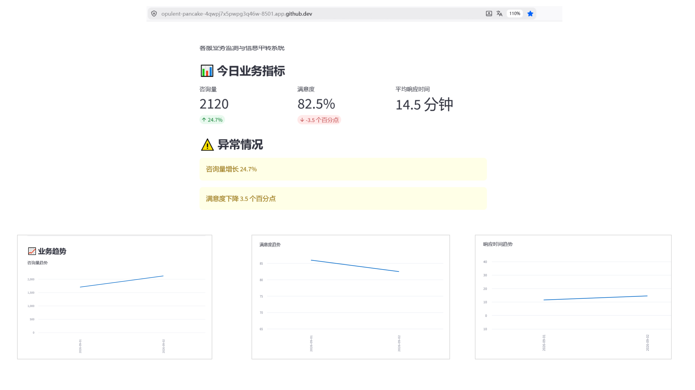
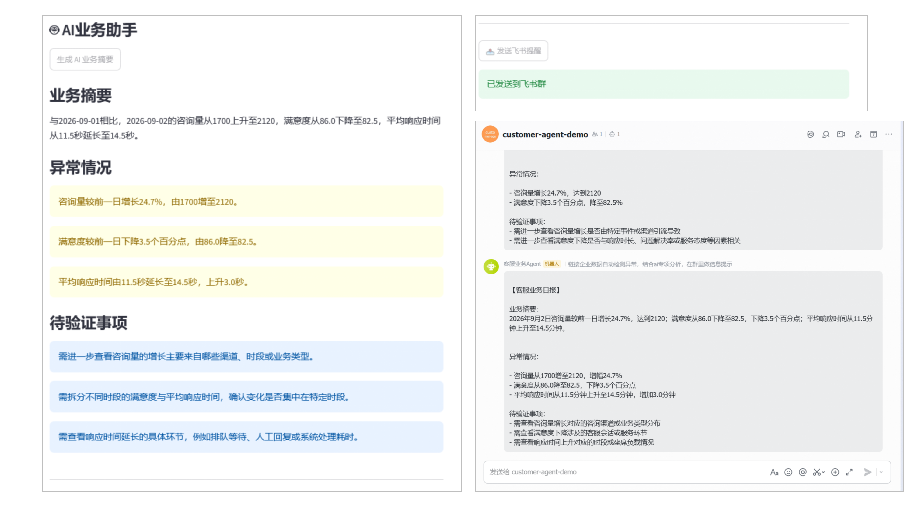

# 客服业务信息中转 Agent


## 项目介绍

客服业务信息中转 Agent 是一个基于业务数据分析、LLM 智能推理和消息推送的 AI Agent 系统。

系统自动读取客服业务指标，分析咨询量、满意度、响应时间等关键指标变化，通过 DeepSeek 生成业务摘要和异常分析，并通过飞书机器人自动通知业务人员。

## 产品背景

在客服业务运营过程中，管理人员通常需要定期查看业务数据，
人工分析咨询量、满意度、响应时间等指标变化。

传统方式存在：

- 数据查看依赖人工
- 异常发现不及时
- 缺少趋势分析能力
- 业务信息传递效率低

本项目通过 AI Agent 自动完成业务数据分析、
异常识别、业务摘要生成以及消息通知。

## 解决的问题

传统客服运营过程中：

- 需要人工查看数据报表
- 难以及时发现业务异常
- 数据变化缺少原因分析
- 信息传递依赖人工


本项目通过 Agent 实现：

数据 → 分析 → AI判断 → 信息推送

## 产品功能

### 1. 业务指标监测

自动分析：

- 咨询量变化
- 用户满意度变化
- 平均响应时间变化


### 2. 异常检测

根据业务规则识别：

- 咨询量异常增长
- 满意度下降
- 响应时间升高


### 3. AI业务分析

通过 DeepSeek LLM：

- 自动生成业务摘要
- 输出异常情况
- 提供待验证事项


### 4. 自动消息推送

通过飞书机器人：

- 自动发送业务日报
- 通知相关业务人员

## 系统架构

客服业务数据  
↓  
SQLite 数据库  
↓  
数据分析模块（analysis/metric.py）  
↓  
DeepSeek Agent（agent/deepseek_agent.py）  
↓  
├── Streamlit业务看板  
└── 飞书机器人自动提醒


## 核心功能


### 1. 业务指标监控

自动计算：

- 咨询量
- 满意度
- 平均响应时间
- 环比变化


### 2. AI业务分析

调用 DeepSeek：

自动生成：

- 业务摘要
- 异常情况
- 待验证事项


### 3. 自动消息推送

通过飞书 Webhook：

将异常情况自动发送给业务人员。


## 技术栈


- Python
- SQLite
- Pandas
- Streamlit
- DeepSeek API
- 飞书机器人 Webhook


## Demo效果


业务数据：
咨询量：2120
增长：24.7%

满意度：82.5%
下降：3.5个百分点

平均响应时间：
14.5分钟


AI分析：
业务摘要：

客服咨询量明显上涨，同时满意度下降。

待验证事项：

1.是否存在渠道活动导致咨询增加
2.是否存在响应能力不足


## 项目目录
```text
customer-agent-demo
│
├── agent
│   └── deepseek_agent.py
│
├── analysis
│   ├── metric.py
│   └── read_data.py
│
├── database
│   └── customer.db
│
├── push
│   └── notify.py
│
├── data
│   └── customer.csv
│
├── app.py
│
└── README.md
```
## Demo展示

### 业务监控页面

系统通过 Streamlit 提供业务分析页面：

- 展示客服核心指标
- 展示业务趋势变化


### AI业务分析推送效果

AI Agent 输出：

- 业务摘要
- 异常情况
- 待验证事项


示例：

> 2026-09-02 客服咨询量为2120，
> 较前期增长24.7%；满意度下降3.5个百分点，
> 需要进一步分析咨询来源及响应时间变化。


## 后续规划

- 接入真实业务数据库
- 增加历史趋势分析
- 增加多业务Agent协作
- 支持更多消息渠道
